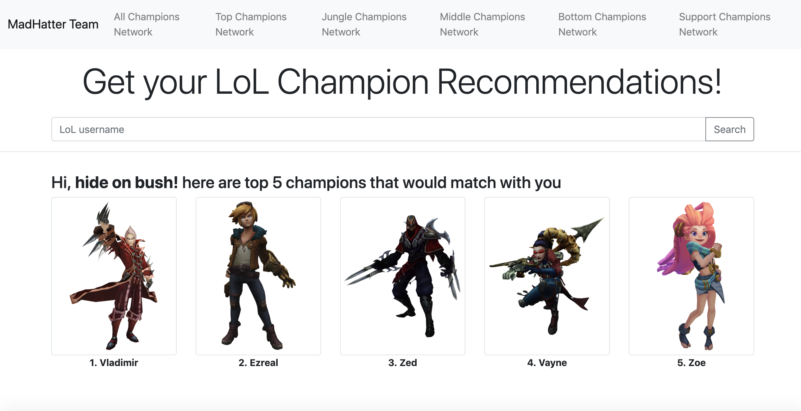
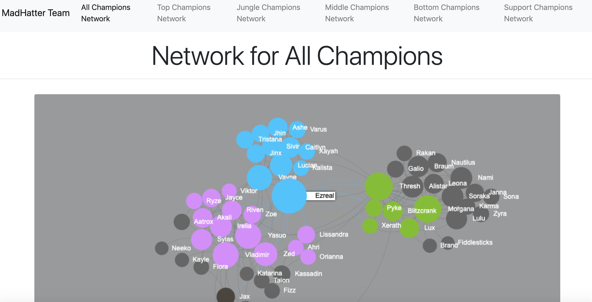

## Project Description 
There are two main features in the web application:
 1. Look up a summoner (player) username in the search box. The result will return the top five champions (with the champion's pictures). 
 
 
 2. View Champion network of each position
 
 


## System Requirements
- beautifulsoup4==4.7.1
- bs4==0.0.1
- certifi==2019.3.9
- chardet==3.0.4
- Click==7.0
- Flask==1.0.3
- gunicorn==19.4.5
- idna==2.8
- itsdangerous==1.1.0
- Jinja2==2.10.1
- MarkupSafe==1.1.1
- numpy==1.16.4
- Pillow==6.0.0
- requests==2.22.0
- riotwatcher==2.6.0
- six==1.12.0
- soupsieve==1.9.1
- torch==1.1.0
- torchvision==0.3.0
- urllib3==1.25.3
- Werkzeug==0.15.4

## How to Use

In the project directory, run the app.py file 

```
python app.py

```
Open http://127.0.0.1:5000/
